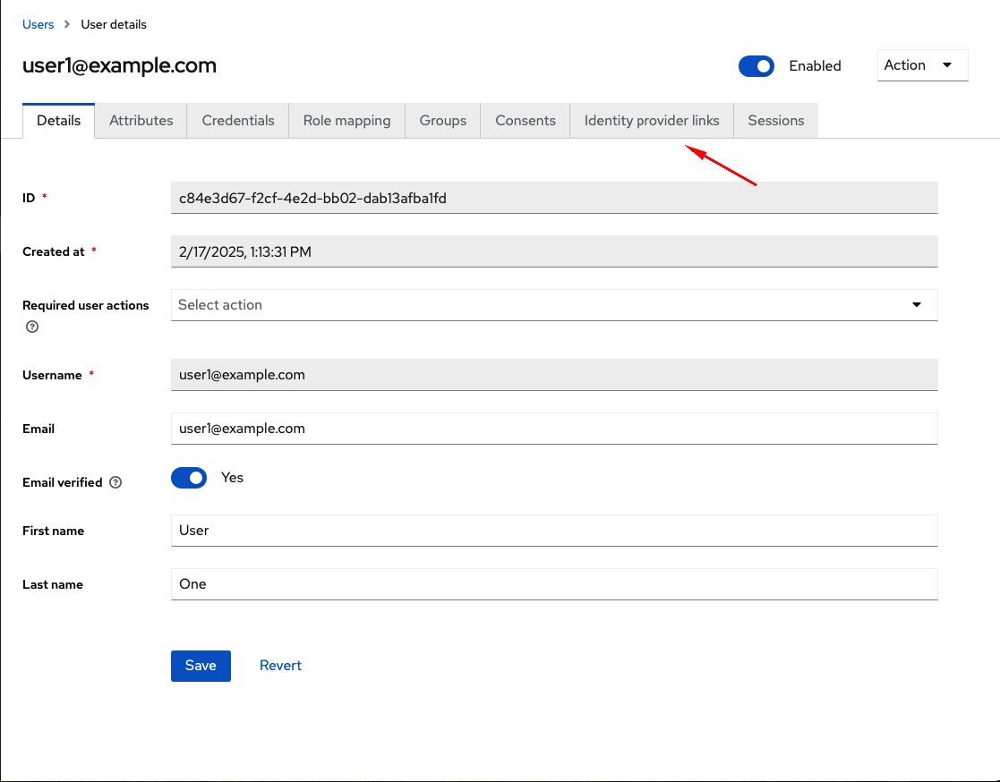
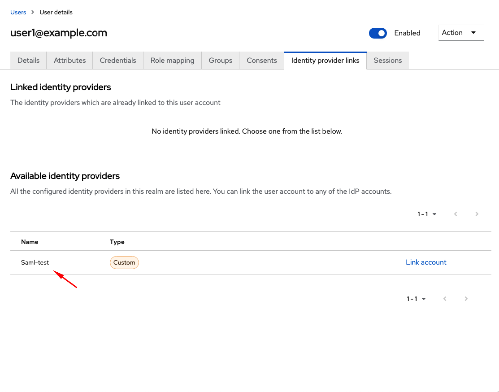
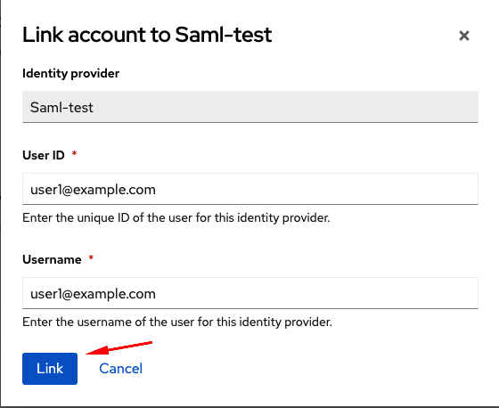

# Setup Keycloak Users for TinaCMS

## Create user in target Keycloak realm

Goto Realm > Users

Select `Add user`

Create a new user with both username and email set to the email address of the SSO user.

Toggle `Email verified` to `Yes`

Make sure there are no required actions selected.

Create the user by pressing `Create`

## Set Identity Provider Links

From the user screen, navigate to `Identity provider links`

From the list of `Available identity providers` select the SAML provider

Click the `Link account` link.

Enter the users email adress in both `User ID` and `Username`. Press the `Link` button.

