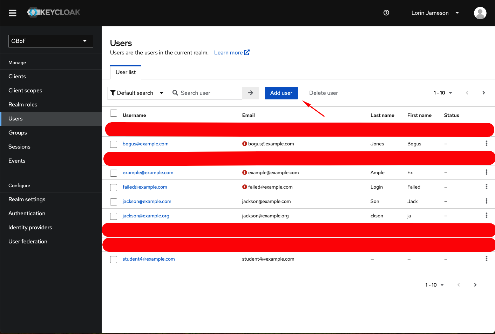
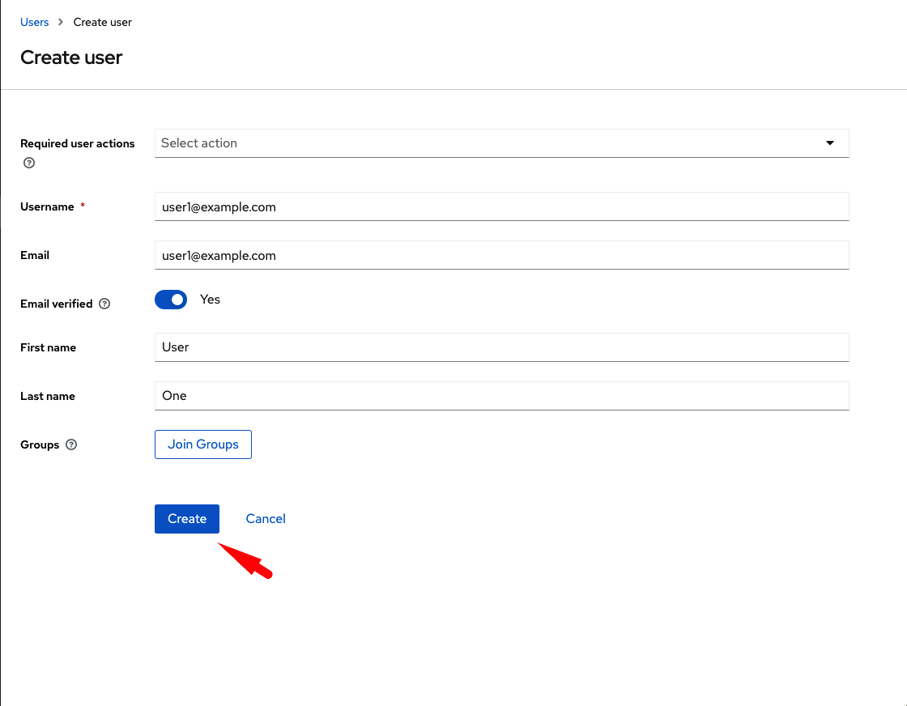
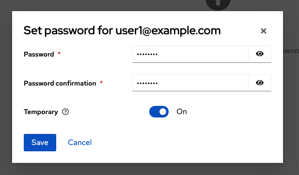

# Setup Keycloak Users for TinaCMS

## Create SSO user in target Keycloak realm

Goto Realm > Users

Select `Add user`

Create a new user with both username and email set to the email address of the SSO user.

Toggle `Email verified` to `Yes`

Make sure there are no required actions selected.

Create the user by pressing `Create`

## Create Login User in target KeyCloak realm

Goto Realm > Users

Select `Add user`

Create a new user with both username and email set to the email address of the SSO user.

Toggle `Email verified` to `Yes`

Create a temporary password for the user

When the user first logs in they will be required to change it.